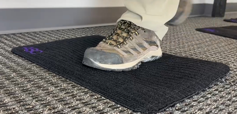

# Project Name: TrampleTek Blue (Home Assistant version)
TrampleTek Blue (Home Assistant version) is a pressure floor sensor for smart homes and businesses. TrampleTek Blue integrates into [Home Assistant](https://www.home-assistant.io/) through [ESPHome](https://esphome.io/).

The installation guide for TrampleTek Blue (Home Assistant version) can be found [here](https://ascmats.github.io/)

